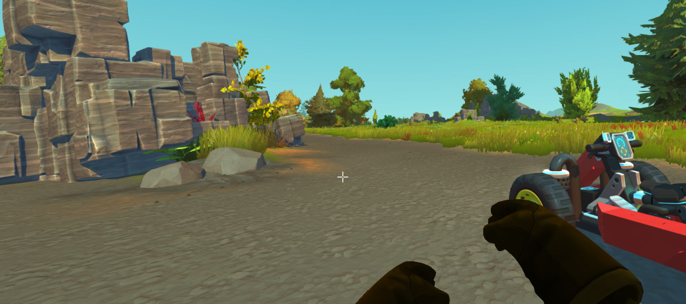
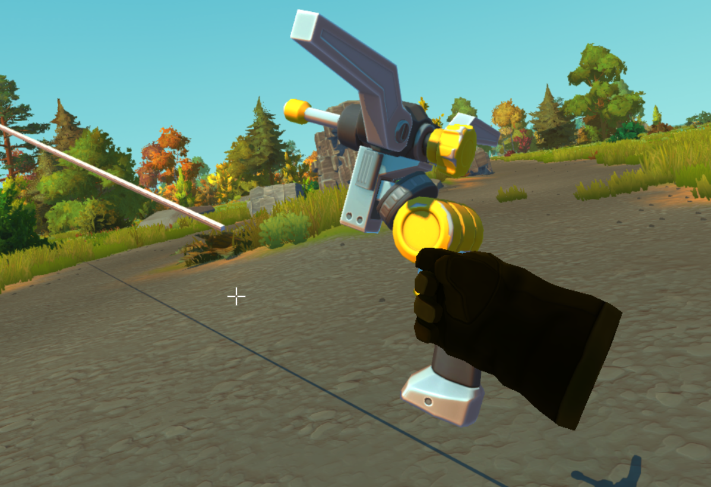
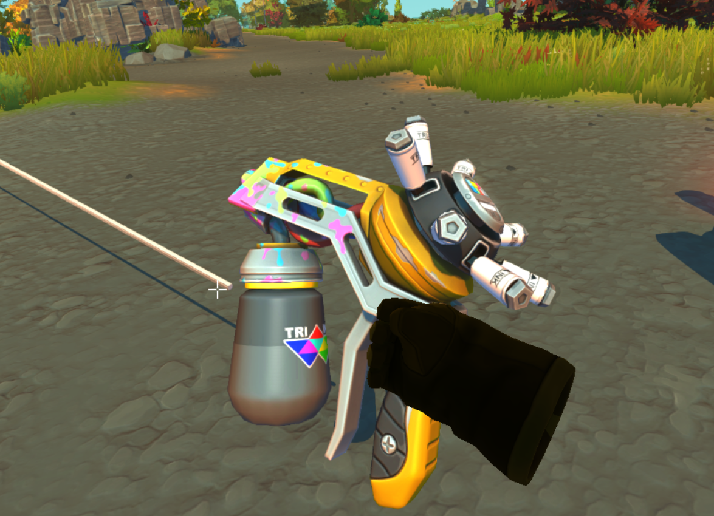
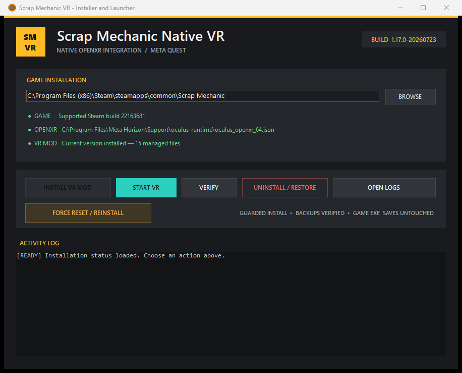

# Scrap Mechanic Native VR

[](https://github.com/21Suspect/Scrap-Mechanic-Native-VR/releases/latest)
[](https://github.com/21Suspect/Scrap-Mechanic-Native-VR/releases)
[](LICENSE)
[](#requirements)

An experimental native OpenXR conversion for **Scrap Mechanic Survival**, built for Meta Quest 3 with Quest Link or Air Link. It adds stereoscopic rendering, tracked hands and tools, Touch-controller locomotion, optical hand tracking, VR interaction rays, spatial menus, seated camera support, and a guarded one-file installer.



## Download and install

> [Download the latest `ScrapMechanicVR-Patcher.exe`](https://github.com/21Suspect/Scrap-Mechanic-Native-VR/releases/latest/download/ScrapMechanicVR-Patcher.exe)

The current release supports **Steam build `22163681` only**. The installer deliberately refuses unknown game builds instead of applying unsafe renderer hooks.

1. Install or update Scrap Mechanic through Steam, then close the game.
2. Connect the Quest through Quest Link or Air Link and make Meta Quest Link the active OpenXR runtime.
3. Download and run `ScrapMechanicVR-Patcher.exe`.
4. Select the Scrap Mechanic folder if it was not detected automatically.
5. Click **Install VR Mod** and approve the Windows administrator prompt.
6. Launch with the new **Start Scrap Mechanic VR** desktop or Start Menu shortcut.

No source checkout or PowerShell knowledge is needed. The installer is currently unsigned, so Windows SmartScreen may show an “Unknown publisher” warning. Compare the SHA-256 value in the release notes or `SHA256SUMS.txt` before running it.

## What works

- Native stereo OpenXR rendering with head tracking and a desktop eye mirror.
- Quest Touch controllers plus Meta optical hand tracking.
- Stable yaw-only, HMD-relative locomotion and horizontal snap/smooth turning.
- Visible tracked mechanic hands, held tools, gun barrel targeting, hammer swings, and tool laser pointers.
- Lift placement, block placement/removal, painting, welding, connection dragging, switches, buttons, guns, and elevators.
- Floating VR backpack, pause, options, and other existing game menus with pointer, click, hold, and drag support.
- First-person seated play with Scrap Mechanic's Strict Follow Camera.
- One-second two-thumbstick recenter for yaw, pitch, roll, and floor alignment.
- Guarded installation, verification, repair, timestamped backups, conflict preservation, and full uninstall/restore.

The permanent health, food, water, and hotbar HUD is intentionally not duplicated as a head-locked overlay.

## Controls

| Quest control | Action |
| --- | --- |
| Left stick | Move |
| Right stick | Aim/turn; scroll an open menu |
| A | Jump; click/hold/drag in an open menu |
| B | Use/interact |
| Right trigger | Primary action |
| Left trigger | Secondary action |
| X / Y while standing | Previous / next hotbar item |
| X + Y while standing | Open backpack |
| X / Y while seated | Zoom in / out |
| Left controller menu button | Pause/resume |
| Hold both thumbsticks for one second | Recenter view and floor |
| Optical pinch | Primary tool/menu interaction |
| Physical hammer swing | Hammer attack |

## Screenshots

| Tool alignment and VR laser | Paint-tool interaction |
| --- | --- |
|  |  |

### Installer



## Requirements

- Windows 10 or Windows 11, x64.
- Steam copy of Scrap Mechanic, exact supported build `22163681`.
- Meta Quest 3 tested; other OpenXR headsets are experimental.
- Meta Quest Link/Air Link and an active 64-bit OpenXR runtime.
- A GPU capable of rendering the game twice at the configured headset resolution.

This is an unofficial community project and is not affiliated with or endorsed by Axolot Games, Meta, Valve, Khronos, or the ReShade project.

## Updating, repairing, and uninstalling

Open `ScrapMechanicVR-Patcher.exe` again:

- **Verify** checks every managed file.
- **Force Reset / Reinstall** restores a recognized older snapshot and installs the current one.
- **Uninstall / Restore** restores the hash-verified original Steam files.
- **Open Logs** opens the detailed installer diagnostics.

If a managed file was edited after installation, the patcher preserves it under `%LOCALAPPDATA%\ScrapMechanicVR\conflicts` before restoring the original. Backups and transaction state live under `%LOCALAPPDATA%\ScrapMechanicVR`.

Before updating Scrap Mechanic in Steam, use **Uninstall / Restore**. A game update can invalidate native renderer hooks even when the Lua scripts appear unchanged.

See [Troubleshooting](docs/TROUBLESHOOTING.md) for common installation, OpenXR, rendering, controller, and restore problems.

## Build from source

The repository contains the installer, native C++ source, Lua integration, manifest, and guarded patching pipeline.

```powershell
git clone https://github.com/21Suspect/Scrap-Mechanic-Native-VR.git
cd Scrap-Mechanic-Native-VR
.\Get-Dependencies.ps1
.\Build-And-Deploy.ps1 -GamePath "C:\Program Files (x86)\Steam\steamapps\common\Scrap Mechanic"
```

Build the one-file installer:

```powershell
.\Build-OneFileInstaller.ps1
```

See [Development and architecture](docs/DEVELOPMENT.md) before changing renderer hooks or payload hashes.

## Project layout

| Path | Purpose |
| --- | --- |
| `source/NativeVR` | Native OpenXR/ReShade add-on source and pinned API headers |
| `payload` | Files installed into the supported Scrap Mechanic build |
| `installer` | One-file Windows installer/launcher UI |
| `Patcher.ps1` | Guarded install, verify, repair, migration, and restore engine |
| `manifest.json` | Supported executable identity and original/patched file hashes |
| `Build-OneFileInstaller.ps1` | Validates and embeds the distributable payload |
| `docs` | User and developer documentation plus screenshots |

## Contributing

Bug reports, headset compatibility results, documentation, and pull requests are welcome. Read [CONTRIBUTING.md](CONTRIBUTING.md) and include the game build, headset/runtime, relevant log tail, and exact reproduction steps.

## License and game-content notice

Original project code is available under the [MIT License](LICENSE). Third-party components retain their own licenses, and Scrap Mechanic-derived scripts, models, textures, names, and screenshots remain the property of Axolot Games. They are not relicensed under MIT. Read [LEGAL.md](LEGAL.md) and [THIRD_PARTY_NOTICES.md](THIRD_PARTY_NOTICES.md).

Users must own Scrap Mechanic. The project does not include `ScrapMechanic.exe`, Steam ownership files, save games, or enough content to run the game independently.
