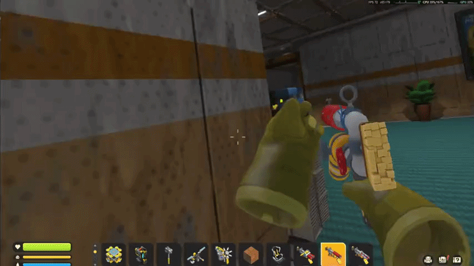

# Scrap Mechanic Native VR — Chapter 2

Native OpenXR VR for the current Scrap Mechanic Chapter 2 / 1.0 release, made by [21Suspect](https://github.com/21Suspect).

## Easy installation

1. Close Scrap Mechanic.
2. Download and run **[ScrapMechanicVR-Installer.exe](https://github.com/21Suspect/Scrap-Mechanic-Native-VR/raw/refs/heads/main/dist/ScrapMechanicVR-Installer.exe)**.
3. Click **Install VR Mod** and approve the administrator prompt.
4. Start your OpenXR runtime, connect and wake the headset, then click **Start VR** or use the new desktop shortcut.

For Virtual Desktop, select **VDXR** as the OpenXR runtime in Virtual Desktop Streamer before connecting the headset. You can also select **SteamVR**, provided SteamVR is configured as the active OpenXR runtime. The installer supports both paths and checks the connected headset through the selected runtime.

The installer has five clear actions: **Install VR Mod**, **Uninstall VR Mod**, **Start VR**, **Open Logs**, and **Open Bindings**. Install automatically removes a detected older/current managed build before upgrading, and both install and uninstall verify their result automatically. Start VR checks that the active OpenXR runtime reports a connected headset. The installer is currently unsigned, so Windows SmartScreen may ask for confirmation.

## Features

- Native stereo OpenXR rendering at the headset-recommended `2064 × 2272` resolution per eye.
- Six-degree-of-freedom head tracking, correct stereo depth and perspective, exact runtime FOV, and the VR seam fix.
- A level standing horizon with mouse/controller pitch-height movement removed, while seats retain Scrap Mechanic's original camera orbit.
- OpenXR 1.1 Meta Touch, legacy Oculus Touch, Valve Index, and generic OpenXR controller profiles, plus optional Meta Quest optical hand tracking.
- Profile-aware controller bindings with safe Quest 3 defaults and SteamVR/Valve Index menu and sprint defaults that avoid the Steam dashboard conflict and thumbstick-click turning.
- Tracked mechanic gloves with animated fingers and no artificial arms.
- VR locomotion, turning, jump, crouch, sprint, interaction, hotbar controls, seated zoom, pause, and recentering.
- Tracked hammer, connection tool, paint tool, weld tool, lift, handbook, potato weapons, Chapter 2 scrap spudgun, potato launcher, and clay gun.
- Complete grouped held-item geometry for blocks, parts, buckets and their contents, glowsticks, cornades, loose clay, extinguisher, seed packets, fertilizer, every food and drink, feeder food, soil bags, keycards, power cores, resources, carried objects, and the logbook.
- VR-hand action origins for throwing, spraying, placing, targeting, inserting, dropping, eating, and using held items.
- Aim the right hand and use B for Scrap Mechanic's normal interactions, including holding B to refine loose wood, stone, or metal; a small amber surface marker shows the exact target without drawing a laser.
- Right-trigger hammer attacks follow the right-hand aim, and tracked weapons fire from their calibrated VR barrels.
- Calibrated Chapter 2 clay-gun grip and moving parts, with the included clay-gun calibration helper.
- Included held-item calibration helper: run `ScrapMechanicVR-HeldCalibration.exe` before or after Scrap Mechanic to tune grouped poses live; it attaches when the game starts. Use **Export text...** to save a shareable plain-text configuration for review or hardcoding.
- World-locked startup and in-game spatial menus using Scrap Mechanic's live native UI.
- Right-hand menu laser, native hover/click/hold/drag input, and smooth transparent menu presentation.
- Controller keyboard and pointer events are queued inside Scrap Mechanic, so gameplay remains responsive through Meta, VDXR, and SteamVR even when the desktop window is not foreground.
- Restrained controller haptics for UI, tools, weapons, interactions, and recentering.
- Fixed compact curved smartwatch-style wrist HUD: left glove vitals/health, a dynamic blue underwater oxygen bar, and in-game time; right glove a world-space compass with cardinal markers and live quest, beacon, raid, enemy, and event waypoints.
- Normal PC mode keeps the standard first-person viewmodel; VR mode removes it.
- Survival, Creative, and Custom Games share the same tracked-hand, held-item, and spatial-menu integration.
- Chapter 2 VR Mod branding on both the desktop and VR main menus.
- Guarded one-file installation with automatic hash verification, backups, version migration, and complete restore.

## Controls

| Quest / Valve Index control | Action |
| --- | --- |
| Left stick | Move |
| Right stick | Smooth turn / look up and down; scroll an open menu |
| Quest A / Index right A | Jump; click, hold, or drag in a menu |
| Grip + Quest A / Index right A while pointing at an inventory or chest slot | Quick-transfer the item between inventories |
| Quest B / Index right B | Use / interact along the right-hand aim ray; hold to refine loose resources |
| Right trigger | Primary action |
| Right trigger + right grip (Index/middle-finger triggers) | Force-build the held item (the game's **F** action) |
| Left trigger | Secondary action |
| Quest X / Y or Index left A / B while standing | Previous / next hotbar item |
| Hold Quest Y / Index left B, or press Quest X + Y / Index left A + B while standing | Open backpack |
| Quest X / Y or Index left A / B while seated | Zoom in / out |
| Quest left menu / Index left trackpad press | Pause / resume (the Index system button remains available only if explicitly selected in bindings) |
| Index left grip | Sprint by default; change it in the SteamVR bindings section |
| Right grip + right stick up / down while standing | Raise / lower the lift using your current Scrap Mechanic Lift Up / Lift Down bindings |
| Hold both thumbsticks for one second | Recenter view and floor |
| Optical pinch | Primary tool or menu interaction |

Set `VerticalStickLook=0` in `Release\ScrapMechanicVR.ini` if you want the right stick to turn horizontally only; headset pitch remains unchanged.

### Controller bindings

Use **Open Bindings** in the installer to open `Release\ScrapMechanicVR.ini`. Edit the `[Bindings.Quest]` section for Quest 3 or `[Bindings.SteamVR]` for Valve Index (SteamVR's Index profile), then restart Scrap Mechanic/VR. Each command accepts `none`, `left/right_primary`, `left/right_secondary`, `left/right_stick_click`, `left/right_grip`, `left/right_trigger`, `left_menu`, `left_trackpad_click`, or `left_system`. The shipped Quest section preserves the established Quest 3 controls; the SteamVR section uses the left trackpad for the in-game menu and left grip for sprint.

For held-item tuning, the helper automatically connects to a running Scrap Mechanic installation even when it is copied to another folder, and keeps checking if the game is launched afterward. If the game is closed, keep the helper beside its `.ini`; the helper will attach as soon as the game starts. **Export text...** writes all grouped position, rotation, and scale values without embedding a personal path.

## Requirements

- Windows 10 or Windows 11, x64.
- Steam Scrap Mechanic `1.0.5.876`, Steam build `24529696`.
- A 64-bit OpenXR runtime, such as Meta Quest Link, Virtual Desktop VDXR, or SteamVR OpenXR.

## Legacy game version

Looking for the mod made for Scrap Mechanic before Chapter 2 / 1.0? It is preserved on the **[legacy-pre-1.0 branch](https://github.com/21Suspect/Scrap-Mechanic-Native-VR/tree/legacy-pre-1.0)**.

Do not mix files or installers from the legacy and current builds.

## Build and support

Build instructions are in [BUILD.md](BUILD.md). Installer and payload checksums are recorded in [SHA256SUMS.txt](SHA256SUMS.txt).

If you enjoy the project, you can [buy 21Suspect a coffee](https://buymeacoffee.com/21suspect).

This is an unofficial community project and is not affiliated with Axolot Games, Meta, Valve, Khronos, or ReShade. Original project code is under the [MIT License](LICENSE); third-party and Scrap Mechanic-derived assets retain their respective rights. See [LEGAL.md](LEGAL.md) and [THIRD_PARTY_NOTICES.md](THIRD_PARTY_NOTICES.md).
